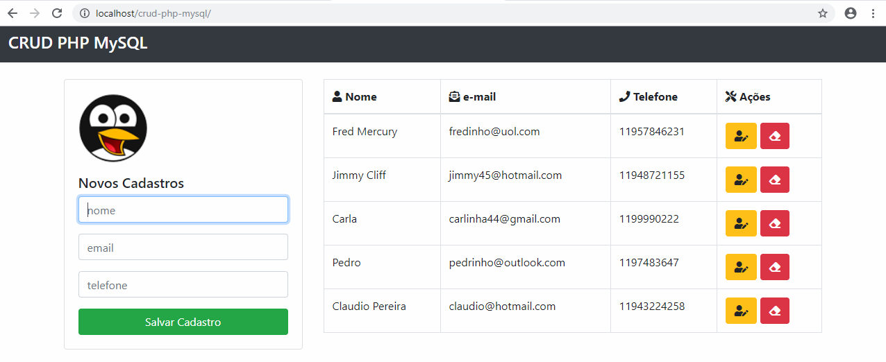

# Etapas para execução
### 1. Banco de Dados
Criei o banco de dados no SQL, pelo PHPMyAdmin.
### 2. Conexão
Criei o arquivo db.php, fazendo o vínculo com o banco de dados.
### 3. Página principal
Crie o index.php, fiz incluí o db.php.
### 4. Includes
Criei os arquivos footer.php e header.php com os scripts e frameworks, para incluir eles nos arquivos, padronizando e evitando retrabalho.
### 5. Formulário
Criei o formulário no index.php e fiz o vínculo com o save_task.php.
### 6. Novos dados
Criei o save.task.php para salvar os dados inseridos no formulário no banco de dados e dar alerta de confirmação ou erro de gravação.
### 7. Exibição dos dados
Criei uma tabela para exibir os dados existentes no banco de dados.
### 8. Edição
Criei o edit.php, que quando ativado abre um novo formulário para fazer a edição dos dados do banco de dados e apliquei um ícone com link para ele na tabela de exibição.
### 9. Deletar
Criei o delete_task.php para apagar os dados do banco de dados e apliquei um ícone com link para ele na tabela de exibição.
### 10. Testes
Testei a aplicação, identifiquei um erro no banco de dados e corrigi.
### 11. Entrega - github
Os arquivos foram todos disponibilizados no github, no seguinte endereço: https://github.com/ivanmatuck/desafio_frontend
### 12. Entrega - hospedagem
Não foi solicitado, mas como o teste envolve banco de dados, que teria que ser hospedado em localhost na máquina de quem fosse testar para funcionar, hospedei o teste de forma funcional em um subdominio no site de um amigo.
### 13. README
Finalizei agora o README com os passos e vou fazer o upload no github.

### Obrigado pela oportunidade!

# Screenshot

